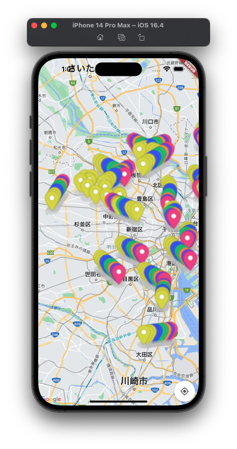
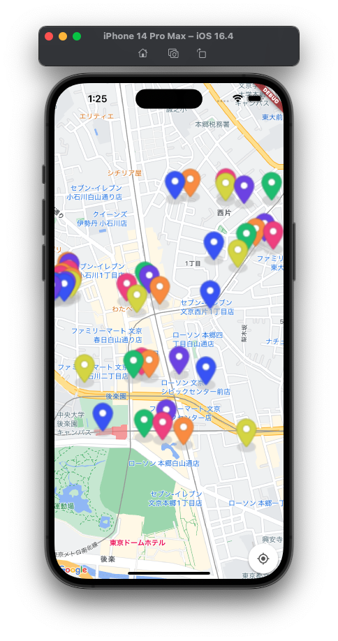

# SolutionChallenge2023-Gaijin Recycle
This is our team's project for the Solution Challenge 2023, it is an app. This app is a tool which foreigners can use inorder to sort their trash in accordance with the rules of each ward in Tokyo. 


Some of the SDG's covered in our project:
    GOAL 11: Sustainable Cities and Communities
    GOAL 12: Responsible Consumption and Production
    GOAL 14: Life Below Water
    GOAL 15: Life on Land


We believe that this project will help ease the transition into life in Japan for many people. This is due to the vast amount of students we have seen struggle with garbage sorting during their first month in Japan. This app can also help educate people on the importance of waste sorting.
 

## Running the program

After downloading this repository as a zip or cloning it. Open it using Visual Studio Code. Make sure you have a working IOS Emulator.

Run the following command

    flutter run

or

    flutter run --no-sound-null-safety  
    
   
## Adding MAP-API-KEY

To use the map functionality in the app, you need to add your own MAP API key to the `AppDelegate.swift` file. Follow the steps below:

1. Open the project in Visual Studio Code.
2. Locate the `AppDelegate.swift` file in the `ios` directory of your project.
3. In the `AppDelegate.swift` file, find the `didFinishLaunchingWithOptions` method.
4. Inside the method, look for the line that starts with `GMSServices.provideAPIKey`.
5. Replace the placeholder string with your actual MAP API key.

Here's an example of how the relevant section of the `AppDelegate.swift` file should look after adding the API key:

```swift
    import UIKit
    import Flutter
    import GoogleMaps
    @UIApplicationMain
    @objc class AppDelegate: FlutterAppDelegate {
      override func application(
        _ application: UIApplication,
        didFinishLaunchingWithOptions launchOptions: [UIApplication.LaunchOptionsKey: Any]?
      ) -> Bool {
        GMSServices.provideAPIKey("YOUR_MAP_API_KEY") // Replace with your actual MAP API key
        GeneratedPluginRegistrant.register(with: self)
        return super.application(application, didFinishLaunchingWithOptions: launchOptions)
      }
    }
```
The map should look like this:


    

## Known Issues

- Lexical or Preprocessor Issue (Xcode): 'vector' file not found. Parse Issue (Xcode): Could not build module 'tflite'

Try making sure the pod file is up to date
    
    pod deintegrate, install, update, repo update

If this doesn't resolve the issue:

    Open ios/Runner.xcworkspace in Xcode, click Runner > Tagets > Runner > Build Settings, search Compile Sources As, change the value to Objective-C++
    
    
- Parse Issue (Xcode): Use of '@import' when C++ modules are disabled, consider using -fmodules and -fcxx-modules

Follow the error message and do the following

    Open ios/Runner.xcworkspace in Xcode, click Runner > Tagets > Runner > Build Settings, search Other C++ Flags, add the compiler flag -fcxx-modules


